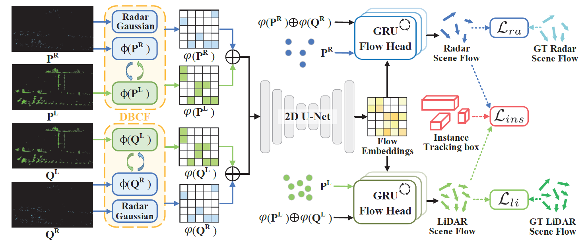

# RaLiFlow: Scene Flow Estimation with 4D Radar and LiDAR Point Clouds
Source Code for AAAI 2026 paper: "RaLiFlow: Scene Flow Estimation with 4D Radar and LiDAR Point Clouds"
Paper Link:[](http://arxiv.org/abs/2512.10376)


## 0. Setup
**Environment**: Clone the repo and build the environment. We use conda to manage the environment.
check [detail installation](https://github.com/KTH-RPL/OpenSceneFlow/assets/README.md) for more information. 

```bash
conda env create -f environment.yaml
```

CUDA package (need install nvcc compiler):
```bash
# CUDA already install in python environment.
cd assets/cuda/chamfer3D && python ./setup.py install && cd ../../..
```

## 1. Data Preparation
### A. Download The View-of-Delft dataset [(VoD)](https://github.com/tudelft-iv/view-of-delft-dataset)
The dataset is organized as follows:
```
PATH_TO_VOD_DATASET
    ├── image_2
    │   │── 00001.jpg
    |       ...
    ├── pose
    │   │── 00001.json
    |       ...
    |       ...
    ├── label_2_withid
    │   │── 00001.txt
    |       ...
    |
    ├── lidar
    │   │── training
    │       ├── velodyne
    │           ├── 00001.bin
    │       ...
    │   │── calib
    │       ├──00001.txt
    │       ...
    ├── radar_5frames
    │   │── training
    │       ├── velodyne
    │           ├── 00001.bin
    │       ...
    │   │── calib
    │       ├──00001.txt
    │       ...
    ├── seg_ground_5frames
    │   │── training
    │       ├──00001.txt
```

### B. Generate VoD Scene Flow Dataset in .h5 format
In each script that needs to be run, the parts where the **PATH** or **MODE** needs to be modified for Reproduction have been highlighted with **"TO DO"**.
```bash
# You need to change the path in flow_gt_gen.py
# change the val/train mode to generate the Training set and Validation set seperately.

cd ./dataprocess
python flow_gt_gen.py
```

Note that we adopt the ground removal algorithm from [Fast segmentation of 3d point clouds for ground vehicles]([https://github.com/KTH-RPL/DeFlow](https://github.com/HuangCongQing/linefit_ground_segmentation_details)).
And we provide the pointwise ground labels for 5_frame_radar and 1_frame_radar versions on VoD:
[5_frame_version](https://pan.quark.cn/s/586ec31f4ff8)
[1_frame_version](https://pan.quark.cn/s/d4091f579c6d)

### C. Generate Dynamic Radar-guided Gaussion Weights for .h5 files
```bash
# You need to change the **PATH** or **MODE** in ./conf/gen_gauss.yaml
# change the val/train mode to generate gaussion weights for the Training set and Validation set seperately.

cd ..
python gen_gauss.py
```

## 2. Training
```bash
# You need to change the **PATH** in ./conf/fusion_config.yaml
# Maybe also the GPU settings

cd ..
python train.py
```
Please check `/checkpoint` file for our trained model.


## 3. Evaluation
```bash
# You need to change the **PATH** in ./conf/fusion_eval.yaml

cd ..
python eval.py
```


## Cite & Acknowledgements
❤️: [OpenSceneFlow](https://github.com/KTH-RPL/OpenSceneFlow)
❤️: [DeFlow](https://github.com/KTH-RPL/DeFlow), [BucketedSceneFlowEval](https://github.com/kylevedder/BucketedSceneFlowEval)
❤️: [SeFlow](https://github.com/KTH-RPL/SeFlow)


